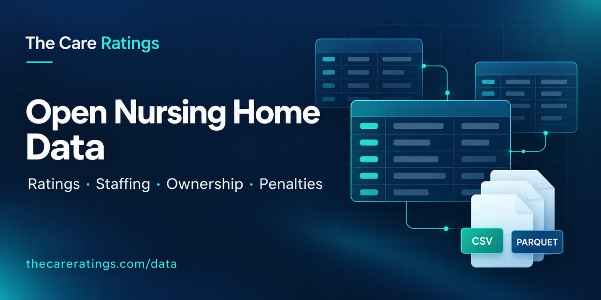
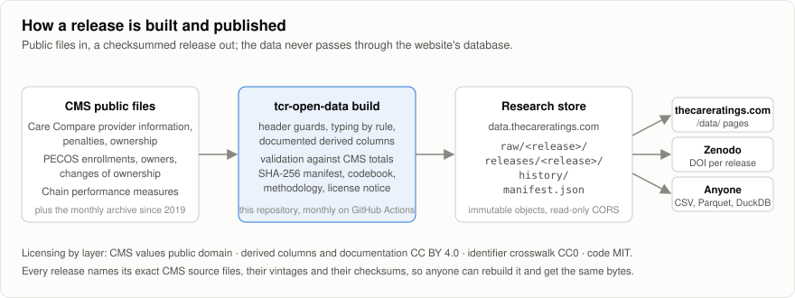
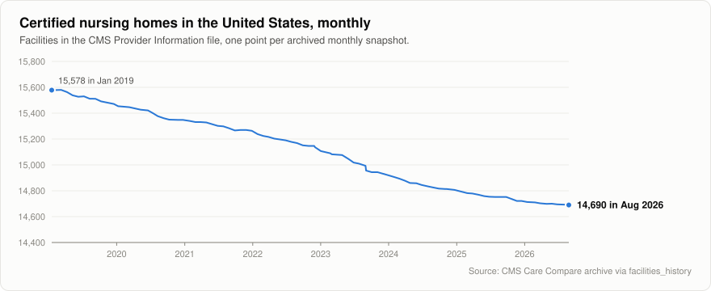
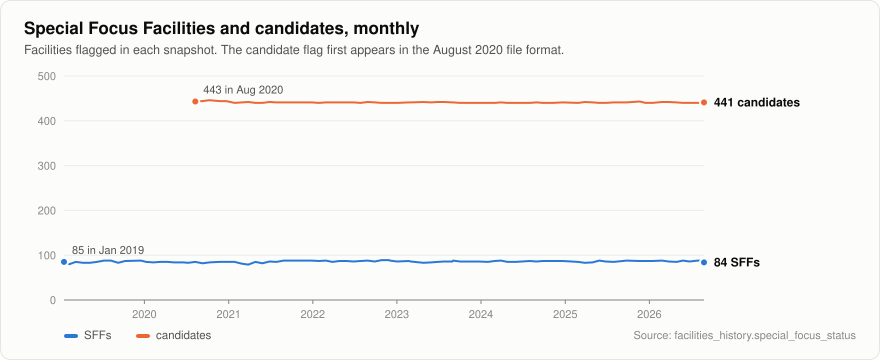
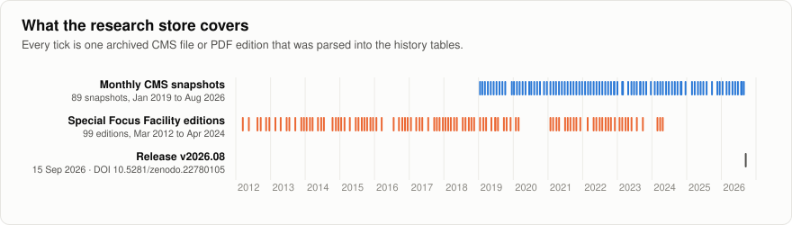

# The Care Ratings Open Nursing Home Data

Monthly, versioned, facility-level releases of U.S. nursing home data, built by this repository from public files of the Centers for Medicare & Medicaid Services (CMS). Anyone can rebuild a release from the same CMS files and get the same bytes.



Each release contains eight tables as CSV and Parquet:

| Table | Rows (v2026.08) | What it is |
| --- | ---: | --- |
| `facilities` | 14,690 | One row per certified nursing home: Care Compare ratings, staffing, penalties, chain, plus its PECOS enrollment and ownership disclosures |
| `penalties` | 15,696 | Fines and payment denials (CMS three-year lookback) |
| `owners_carecompare` | 249,452 | Owner and manager roles as shown on Care Compare |
| `owners_pecos` | 295,083 | Every CMS-855A owner, officer and additional disclosable party, with the private-equity, REIT and other disclosure flags |
| `changes_of_ownership` | 5,227 | Buyer and seller enrollments for each change of ownership |
| `chains` | 611 | CMS chain (affiliated entity) performance measures, national row included |
| `state_summary` | 54 | Per-state and national aggregates, including the Care Quality Index components |
| `crosswalk` | 14,690 | CCN, PECOS enrollment id, NPI, affiliation entity id and chain id (CC0) |

Every column is tagged with its provenance (`cms` or `tcr`) in the [codebook](docs/codebook.md); derived columns are explained in the [methodology](docs/methodology.md). Licensing is layered by [LICENSE-DATA.md](LICENSE-DATA.md): CMS values are public domain, our derived columns are CC BY 4.0, the crosswalk is CC0, and the code is MIT.

## Releases

Releases are named after the year and month of the Care Compare Provider Information processing date (`v2026.08`) and stored in the research store under `releases/<release>/`, with the CMS files they were built from under `raw/<release>/` and a root `manifest.json` that lists every release. Each release ships `manifest.json` (files, SHA-256 checksums, row counts, source vintages, validation report), `codebook.md`, `methodology.md`, `LICENSE-DATA.md` and `CHANGELOG.md`.

Download pages: <https://thecareratings.com/data/>. Downloads there ask for an email address and a human check the first time, then hand out short-lived signed links from the private research store. The same files, with the same checksums, can be downloaded without either from the Zenodo archive of each release (v2026.08: <https://zenodo.org/records/22780105>). `manifest.json` in each release lists every file with its SHA-256.

## Build it yourself



```bash
python -m venv .venv && . .venv/bin/activate     # Windows: .venv\Scripts\activate
pip install -e . pytest
pytest -q

# Download the current CMS files, build, validate and write the manifest (no upload):
tcr-open-data release

# Or step by step:
tcr-open-data download --raw raw/next
tcr-open-data build --raw raw/v2026.08 --out releases
tcr-open-data validate --release releases/v2026.08 --strict
tcr-open-data manifest --release releases/v2026.08
tcr-open-data publish --release releases/v2026.08 --raw raw/v2026.08          # dry run: prints the object keys
tcr-open-data publish --release releases/v2026.08 --raw raw/v2026.08 --live   # needs TCR_R2_* environment
```

Validation reconciles the release with the national row of the CMS chain file (facility count, Special Focus Facilities, abuse icons, fines, payment denials) and checks PECOS and chain-id coverage. A CMS header change stops the build and names the columns involved.

## Research store

Releases are published to a dedicated Cloudflare R2 bucket through the S3 API. Configure `TCR_R2_ACCOUNT_ID`, `TCR_R2_ACCESS_KEY_ID`, `TCR_R2_SECRET_ACCESS_KEY` and optionally `TCR_R2_BUCKET` (default `careratings-open-data`). The GitHub Actions workflow `build-release.yml` runs the build monthly and publishes when those secrets are configured.

The bucket is private. The website reads it through the S3 API with a read-only token and issues signed download links behind its gate; the custom domain `data.thecareratings.com` exists but has public access disabled. Release and raw objects are uploaded as immutable, manifests revalidate every five minutes (`tcr-open-data headers --live` rewrites those headers on objects already stored). Each release is archived at Zenodo for a DOI (`tcr-open-data doi`), and Zenodo is the ungated public copy. Step by step: [docs/publishing.md](docs/publishing.md).

## What the history store shows

Three figures drawn from the history tables (regenerate with `python scripts/readme_charts.py`, which reads the public store):







## History store

Releases are latest-only. The history lives beside them under `history/` in the research store and is rebuilt from public archives, never from the production database:

```bash
tcr-open-data backfill --out history                 # 89 monthly CMS archive snapshots (2019-01 onward), resumable
tcr-open-data reharmonize --out history              # rebuild the typed layer from the raw Parquet after a synonym change
tcr-open-data sff-history --out history              # Special Focus Facility PDFs from the Internet Archive (2012-2024)
tcr-open-data publish-history --history history --live
```

| File | Content |
| --- | --- |
| `facilities_history.parquet` | One row per facility per monthly snapshot: ratings, staffing, penalties, SFF status, chain, case-mix hours, cycle-1 survey score |
| `penalties_history.parquet` | Every distinct fine and payment denial seen in any snapshot (2016 onward) with first and last seen dates |
| `ownership_history.parquet` | Every Care Compare owner relationship with first and last seen dates |
| `sff_history.parquet`, `sff_editions.parquet` | Special Focus Facility tables by edition, with CCNs matched by name and ZIP where the PDF printed none |
| `coverage.csv`, `manifest.json`, `sff_manifest.json` | Which snapshot carried which file and columns, CMS vintages, checksums, failures |

The raw per-snapshot files (`history/raw/<table>/<date>.parquet`) keep every CMS column as text, so the harmonized layer is reproducible. Sections 9 and 10 of the [methodology](docs/methodology.md) describe the column eras and the PDF layouts.

## Analysis tables

The tables behind each research report are built from a release with one command and committed under `analysis/`, so any figure in a report can be checked against them:

```bash
tcr-open-data ownership-study --release releases/v2026.08 --history history --out analysis/ownership/v2026.08
```

`analysis/ownership/v2026.08/summary.md` carries the headline numbers and the caveats; section 11 of the methodology describes every table. The ownership figures are *as disclosed to CMS* (see below), and the Care Compare turnover series breaks in 2025 when CMS changed its role labels and the fuller disclosures under the 2023 ownership rule arrived (methodology, *Care Compare role labels*).

## What this data is not

The ownership disclosure flags are the facility's own answers on Form CMS-855A. A facility that does not disclose a private-equity or REIT owner has not reported one; that is not a finding that it has none. See the methodology's *Owner versus party* section before quoting any ownership figure.

## Citing

> The Care Ratings (2026). Open Nursing Home Data, release v2026.08 (CMS August 2026 vintage). Built from Centers for Medicare & Medicaid Services public files. https://thecareratings.com/data/releases/v2026.08/

Every release is archived at Zenodo under the concept DOI [10.5281/zenodo.22780104](https://doi.org/10.5281/zenodo.22780104); each release has its own version DOI (v2026.08: [10.5281/zenodo.22780105](https://doi.org/10.5281/zenodo.22780105)), listed on the release page and in its `manifest.json`. More formats: <https://thecareratings.com/data/cite/>.

A machine-readable citation is in [CITATION.cff](CITATION.cff). Releases and reports are prepared by the [Care Ratings Team](https://thecareratings.com/blog/authors/care-ratings-team/) and reviewed by the [TCR Editorial Team](https://thecareratings.com/blog/authors/tcr-editorial-team/); the [editorial standards](https://thecareratings.com/data/editorial-standards/) describe what the program will and will not claim.
